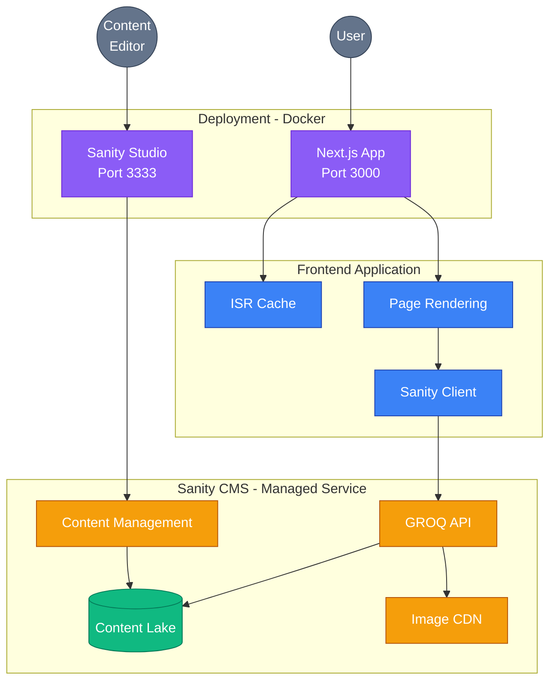
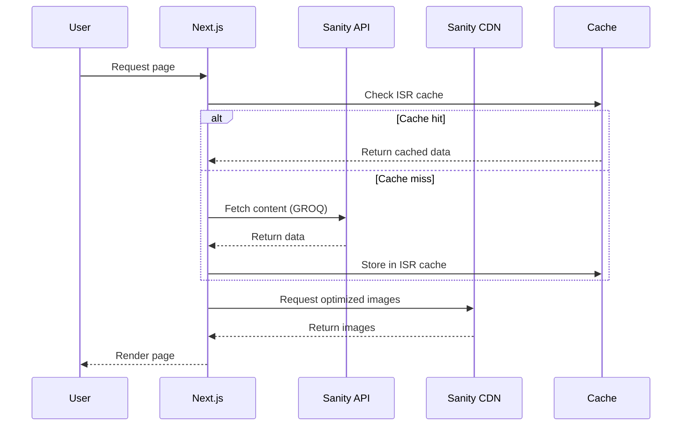
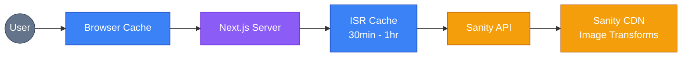
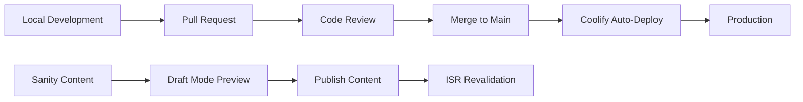

# Personal Hub - Architecture Documentation

## System Overview

Personal Hub is a modern JAMstack application built with Next.js 15 and Sanity CMS, designed to showcase professional achievements, blog posts, and client projects.

## Architecture Diagram

The system consists of three main layers:
- **Deployment Layer**: Docker containers orchestrated by Coolify
- **Frontend Application**: Next.js 15 with ISR caching
- **Backend CMS**: Sanity managed service for content and images



## System Components

### Frontend Layer (Next.js 15)

**Technology Stack:**
- Framework: Next.js 15 (App Router)
- Language: TypeScript
- Styling: Tailwind CSS
- Package Manager: Bun
- Runtime: Node.js 18+

**Key Components:**
- **Page Components**: Server components for homepage, blog, and projects
- **React Components**: Reusable UI components (Hero, Cards, etc.)
- **CMS Integration**: Data fetching layer with Sanity client
- **Image Optimization**: Next.js Image + Sanity CDN

### Content Management System (Sanity)

**Technology Stack:**
- CMS: Sanity.io
- Studio Version: Sanity v4
- Query Language: GROQ

**Content Types:**
- Homepage (singleton)
- Blog Posts (collection)
- Projects (collection)

**Features:**
- Real-time collaboration
- Draft/publish workflow
- Asset management
- Preview mode integration

### Data Flow



## Component Architecture

### Page Structure

```
app/
├── (root)/
│   ├── page.tsx              # Homepage (ISR: 30min)
│   ├── layout.tsx            # Root layout with metadata
│   └── globals.css           # Global styles
├── blog/
│   ├── page.tsx              # Blog listing (ISR: 1hr)
│   └── [slug]/
│       └── page.tsx          # Blog post detail (ISR: 1hr)
├── projects/
│   ├── page.tsx              # Project listing (ISR: 1hr)
│   └── [slug]/
│       └── page.tsx          # Project detail (ISR: 1hr)
└── api/
    ├── draft/
    │   └── route.ts          # Enable draft mode
    └── disable-draft/
        └── route.ts          # Disable draft mode
```

### Library Structure

```
lib/
├── cms.ts                    # Public CMS API
├── sanity/
│   ├── client.ts            # Sanity client config
│   ├── queries.ts           # GROQ queries
│   ├── mappers.ts           # Data transformers
│   └── image.ts             # Image URL builders
```

## Data Models

### TypeScript Interfaces

**Homepage:**
```typescript
interface Homepage {
  name: string
  title: string
  tagline: string
  headshot: ProcessedImage
  bio: string
  socialLinks: {
    github?: string
    linkedin?: string
  }
  contact: {
    email?: string
    location?: string
  }
}
```

**Blog Post:**
```typescript
interface BlogPost {
  id: string
  title: string
  excerpt: string
  slug: string
  publishedDate: string
  thumbnail?: ProcessedImage
  author: string
  readingTime?: number
  content: string
}
```

**Project:**
```typescript
interface Project {
  id: string
  title: string
  description: string
  slug: string
  thumbnail?: ProcessedImage
  featured: boolean
  technologies?: string[]
  link?: string
  content: string
  challenge: string
  solution: string
  outcomes: string[]
  images?: ProcessedImage[]
  completionDate: string
  clientName?: string
}
```

## Performance Strategy

### Incremental Static Regeneration (ISR)

| Route | Revalidation Period | Rationale |
|-------|---------------------|-----------|
| Homepage | 30 minutes (1800s) | Featured content changes frequently |
| Blog listing | 1 hour (3600s) | New posts published occasionally |
| Blog post | 1 hour (3600s) | Individual posts rarely change after publish |
| Project listing | 1 hour (3600s) | Projects updated infrequently |
| Project detail | 1 hour (3600s) | Project details stable after publish |

### Image Optimization

1. **Source**: Sanity Image CDN
2. **Transformations**: On-demand via `@sanity/image-url`
3. **Formats**: WebP, AVIF (automatic)
4. **Sizes**: Responsive srcset generation
5. **Loading**: Next.js Image component with blur placeholders

### Caching Strategy



## Security Architecture

### Authentication & Authorization

**Sanity API Access:**
- Public reads: No token required (CDN mode)
- Draft content: Read token required (server-side only)
- Content editing: Managed via Sanity Studio

**Environment Variables:**
```bash
# Public (client-safe)
NEXT_PUBLIC_SANITY_PROJECT_ID=ktdunyve
NEXT_PUBLIC_SANITY_DATASET=production
NEXT_PUBLIC_SANITY_API_VERSION=2024-01-01

# Private (server-only)
SANITY_API_TOKEN=<read_token>
SANITY_REVALIDATE_SECRET=<webhook_secret>
```

### Draft Mode Security

1. Secret token validation on `/api/draft` endpoint
2. Server-side only token usage
3. Session-based draft mode (HTTP-only cookies)
4. Automatic expiration on browser close

## Deployment Architecture

### Docker & Coolify Platform

**Containerized Deployment:**
1. Multi-stage Docker builds for optimal image size
2. Separate containers for app and studio
3. Docker Compose orchestration
4. Deployed via Coolify for easy management

**Application Container:**
- Base: `oven/bun:1-slim`
- Port: 3000
- Health check endpoint
- Non-root user for security

**Studio Container:**
- Base: `nginx:alpine`
- Port: 3333
- Static build served via nginx
- Health check endpoint

**Coolify Features:**
- Git-based deployments
- Automatic HTTPS/SSL
- Environment variable management
- Zero-downtime deployments
- Built-in monitoring

**Environment:**
- Bun runtime
- Multi-container architecture
- Docker networking
- Health monitoring

## Monitoring & Observability

### Performance Metrics

**Targets:**
- Lighthouse Score: >90
- First Contentful Paint (FCP): <1.5s
- Time to Interactive (TTI): <3.5s
- Cumulative Layout Shift (CLS): <0.1

### Error Handling

**Client-side:**
- React Error Boundaries (to be implemented)
- Graceful degradation for missing content

**Server-side:**
- Try-catch in all CMS functions
- Fallback to empty arrays for listings
- Null handling for detail pages (404)

## Scalability Considerations

### Current Capacity

- **Content**: Unlimited via Sanity
- **Traffic**: Edge caching handles high load
- **Images**: CDN-delivered, globally distributed

### Growth Path

1. **Phase 1** (Current): Static site with ISR
2. **Phase 2**: On-demand revalidation via webhooks
3. **Phase 3**: Analytics integration
4. **Phase 4**: Comment system (if needed)
5. **Phase 5**: Multi-language support

## Development Workflow



### Local Development Setup

1. Clone repository
2. Install dependencies: `bun install`
3. Configure `.env.local` with Sanity credentials
4. Start Next.js: `bun run dev`
5. Start Sanity Studio: `cd studio && bun run dev`

## Technology Decisions

### Why Next.js 15?

- App Router for better performance
- Built-in ISR support
- Excellent TypeScript support
- Server Components for zero JS shipping

### Why Sanity?

- Best-in-class content editing experience
- Real-time collaboration
- Powerful query language (GROQ)
- Generous free tier
- Excellent image CDN

### Why Bun?

- 3-10x faster than npm
- Native TypeScript support
- Drop-in replacement for Node.js
- Built-in test runner

## API Reference

See [API.md](./API.md) for detailed CMS function documentation.

## Troubleshooting

See [TROUBLESHOOTING.md](./TROUBLESHOOTING.md) for common issues and solutions.
